# Refactoring Legacy Code

## Overview

Refactor aggressively inside a safe boundary, not across the whole dependency web.  
Prefer shrinking blast radius before cleaning structure.

Always draft the route before editing code. After the user confirms the route, keep moving until the approved wave finishes or a stop condition fires.

## The Iron Law

```
NO BROAD REFACTOR WITHOUT A BEHAVIOR LOCK AND BLAST-RADIUS MAP FIRST
```

If behavior is not locked or blast radius is unclear, stop and switch to `untangle-first`.

## When to Use

Use this skill for:
- Legacy code that is hard to reason about or dangerous to change
- Spaghetti code, god files, or modules with hidden side effects
- Tight coupling, circular dependencies, or shared mutable state
- Refactors that may break callers, entrypoints, or production behavior
- Requests to split modules, decouple services, or clean up technical debt safely

Do not use this skill for:
- Small isolated bug fixes with a clear failing test
- New feature work in already healthy code
- Pure formatting, lint, or naming cleanup with no structural risk

## Route-First Contract

Before editing source files:
- Produce the six required outputs
- Turn them into a concrete wave order
- Show the route to the user for approval
- Name the first wave boundary explicitly

After approval:
- Execute the approved wave without pausing at every tiny step
- Keep going until the wave is verified and checkpointed
- Stop only when a stated stop condition, boundary spill, or verification failure appears

## Required Outputs

Before proposing or making structural changes, produce exactly these six results:

1. `Current State Map` - key files, entrypoints, callers, dependencies, side effects
2. `Blast Radius` - `low`, `medium`, or `high`, with concrete evidence
3. `Safety Net` - what already locks behavior and what is missing
4. `Mode` - `untangle-first` or `refactor-wave`
5. `Safe Boundary` - the single area that can be changed in this round
6. `Verification Gate` - the commands, checks, and rollback point for this round

Use this output shape:

```text
Risk Level: low|medium|high
Mode: untangle-first|refactor-wave
Current State Map: ...
Safety Net: ...
Safe Boundary: ...
Verification Gate: ...
```

## Decision Flow

```dot
digraph legacy_refactor {
    rankdir=LR;
    start [label="Map current state", shape=box];
    lock [label="Behavior lock exists?", shape=diamond];
    add_lock [label="Create minimal safety net", shape=box];
    radius [label="Blast radius high?", shape=diamond];
    boundary [label="Boundary clear and\nverification adequate?", shape=diamond];
    untangle [label="Use untangle-first", shape=box];
    wave [label="Use refactor-wave", shape=box];
    stop [label="Stop and rescope", shape=box];

    start -> lock;
    lock -> add_lock [label="no"];
    add_lock -> lock;
    lock -> radius [label="yes"];
    radius -> untangle [label="yes"];
    radius -> boundary [label="no"];
    boundary -> wave [label="yes"];
    boundary -> untangle [label="no"];
    untangle -> stop [label="boundary keeps spilling"];
}
```



## Blast-Radius Rules

Treat the refactor as `high` risk when one or more of these are true:
- Circular imports or circular runtime dependencies
- Shared mutable state or global caches with unclear owners
- Hidden side effects such as I/O, network, DB writes, or process state
- Many callers across layers or multiple entrypoints feeding the same module
- Behavior cannot be explained without reading several files at once
- There is no trustworthy test or fixture coverage

Treat the refactor as `low` risk only when all of these are true:
- One bounded module or seam is in scope
- Callers and dependencies are known
- Existing tests or characterization tests lock the visible behavior
- Verification is cheap and repeatable

Treat everything else as `medium` risk.

## Mode Rules

### `untangle-first`

Use this mode when risk is `high`, behavior is fuzzy, or the dependency web is still moving.

Allowed work:
- Add characterization tests, fixtures, snapshots, or smoke scripts
- Add adapters, facades, wrappers, or compatibility seams
- Isolate side effects behind interfaces or helper boundaries
- Split read paths from write paths
- Extract one narrow seam so later waves can be safer

Forbidden work:
- Multi-subsystem rewrites
- Cross-repo renames
- Mixing feature changes with structural cleanup
- Simultaneous edits to multiple high-risk core modules

### `refactor-wave`

Use this mode only when the boundary is small, the callers are known, and verification is ready.

Allowed work:
- Split files and move responsibilities
- Rename concepts inside the current boundary
- Replace internal implementations
- Introduce cleaner internal APIs
- Keep or bridge the external contract while internals change

Rules:
- Change one hotspot per wave
- Keep external behavior stable unless a migration layer is included in the same wave
- End each wave with a verification result and the next recommended wave

## Behavior Lock

Prefer this order when freezing behavior:
- Existing tests
- Characterization tests
- Golden input/output fixtures
- Snapshots
- Focused smoke checklist

If none of these exist, read `references/safety-net.md` and create the smallest useful lock before touching structure.

## Git Discipline

Use git as part of the safety system, not just as record keeping.

Before the first structural edit:
- Ensure the repo has a clean, reviewable starting point
- Create or switch to a dedicated branch for the refactor if that is allowed in the current repo workflow
- Record the baseline commit or rollback point

After each successful wave:
- Commit only that wave
- Use a message that names the boundary or wave goal
- Do not bundle multiple waves into one commit

If verification fails:
- Stop stacking fixes
- Return to the last known-good checkpoint or create a fresh recovery commit only after the failure is understood
- Update the route before continuing

## Stop Conditions

Stop and rescope when any of these happen:
- You cannot explain the current behavior in plain language
- You cannot build even a minimal behavior lock
- The change boundary keeps expanding into new core modules
- One change pulls multiple tightly coupled hotspots into scope
- Verification cost is larger than the value of the current wave

Stopping is success when the alternative is a blind rewrite.

## Common Rationalizations

| Excuse | Reality |
|--------|---------|
| "Let's clean everything while we are here" | Scope creep is how legacy refactors explode. |
| "The structure is obviously wrong, just rewrite it" | Structural intuition is not a behavior lock. |
| "We can fix tests later" | Without a lock, you cannot tell cleanup from regression. |
| "This module is central, so we have to touch everything" | Central modules need smaller seams, not bigger blasts. |
| "One giant PR is faster" | One giant PR hides regressions and blocks rollback. |
| "We will clean up git history at the end" | Late checkpointing destroys rollback precision. |

## Execution Pattern

1. Map the current behavior, callers, dependencies, and side effects.
2. Lock visible behavior with the smallest credible safety net.
3. Classify blast radius with evidence.
4. Choose `untangle-first` or `refactor-wave`.
5. Define one safe boundary and one wave only.
6. Refactor inside that wave.
7. Verify, checkpoint with git, summarize deltas, and recommend the next wave.

## References

- `references/safety-net.md` - how to freeze behavior before refactoring
- `references/legacy-smells.md` - how to spot risky dependency patterns
- `references/refactor-playbook.md` - what to do in each mode
- `references/git-checkpoints.md` - how to use branch and commit checkpoints during refactors
